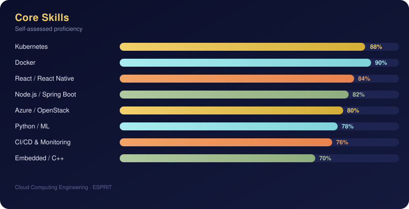

# Hi, I'm Yomna! 👋

**Cloud Computing Engineering Student @ ESPRIT**  
Building cloud-native systems, DevOps pipelines, ML applications & full-stack apps from Tunis 🇹🇳

---

## 🚀 About Me

I'm a **3rd-year Cloud Computing Engineering student at ESPRIT**, passionate about building scalable infrastructure, full-stack applications and intelligent systems. I've shipped real products — from a production Kubernetes deployment for an EdTech analytics platform, to a private OpenStack cloud with 7 nodes, a full mobile coaching app deployed on Azure, and a medical AI platform for early disease detection.

- 🔭 Currently interning as a **Full-Stack Developer & DevOps** at **Edora LMS**, building an analytics portal on top of Moodle
- 🌱 Learning more about **GitOps**, **Terraform** and **service mesh**
- 🤖 Exploring **Machine Learning** applied to real-world health problems
- 💬 Ask me about **Kubernetes/K3s**, **CI/CD**, **OpenStack**, **React Native** or **ML pipelines**
- 📍 Based in Tunis, Tunisia

---

## 🛠️ Tech Stack

### ☁️ Cloud & DevOps

  

### 💻 Backend & Frontend

  

### ⚡ Languages

  

### 🤖 Machine Learning & Data

  

### 🛢️ Databases & Tools

  

---

## 📈 Skills Breakdown

  
  

---

## 🏗️ Featured Projects

### 🎓 Edora — Analytics Portal for Moodle LMS `2026` *(Internship @ Edora LMS)*
> Laravel + React analytics platform extending Moodle, deployed on a self-managed Kubernetes cluster

- Built a **Laravel** API backend and a **React 19/TypeScript** SPA extending a Moodle LMS with a separate analytics platform, keeping heavy reporting off the live Moodle instance
- Implemented Moodle-native authentication (Web Services token exchange, encrypted sessions, Sanctum cookie auth for the SPA)
- Set up scheduled sync jobs pulling courses, grades and completion data from Moodle into a local **PostgreSQL** copy
- Built role-based dashboards (admin/teacher/student) with at-risk student detection
- Deployed to production on a self-managed **Kubernetes (k3s)** cluster on Azure, with **Traefik** ingress, **cert-manager** TLS, a **Jenkins** CI/CD pipeline auto-building/pushing Docker images, **Prometheus/Grafana** monitoring and automated PostgreSQL/MariaDB backups

`Laravel` `PHP` `PostgreSQL` `Redis` `React` `TypeScript` `Docker` `Kubernetes` `Traefik` `Jenkins` `Nginx`

---

### ☁️ TFAKADNI — Cloud-Native Maternal Health Platform `2025–2026`
> Private OpenStack cloud (7 nodes) + Kubernetes cluster + intelligent auto-remediation

- Deployed a full **OpenStack** environment (Keystone, Nova, Neutron/OVN, Glance, Cinder, Swift) on Ubuntu Server 24.04 with automation via nested Heat Templates
- Set up a **Kubernetes v1.29** cluster (kubeadm, Flannel, Containerd) in a 3-tier architecture with StatefulSets, PVC, HPA and Ingress-nginx
- Built a **Prometheus + Grafana + Alertmanager** monitoring stack with an auto-remediation pipeline that automatically fixes `CrashLoopBackOff` pods via the Kubernetes API
- Backend: **Angular + Spring Boot + MySQL** secured with JWT/BCrypt, developed in an Agile/Scrum workflow

`OpenStack` `Kubernetes` `Docker` `Helm` `Ansible` `Prometheus` `Grafana` `Angular` `Spring Boot` `MySQL`

---

### 🧠 MedAssist AI — Medical Diagnosis Platform using Machine Learning `2025–2026`
> ML-powered early detection of serious diseases, deployed via Flask

- Built a medical application targeting early detection of lung cancer, brain tumor, diabetes, depression and anxiety
- Trained and benchmarked multiple ML models (Logistic Regression, Random Forest, XGBoost, LightGBM, SVM, Gradient Boosting) across 5 medical datasets using accuracy, precision, recall, F1-score and AUC metrics
- Deployed a **Flask** prediction interface providing doctors with clear, interpretable results in real time

`Python` `Scikit-learn` `Pandas` `NumPy` `Flask` `XGBoost` `LightGBM` `Gradient Boosting`

---

### 💪 FitLife — Sports & Nutrition Coaching Platform `2025` *(Internship @ Teck Catalyze)*
> End-to-end mobile + web app shipped in 6 weeks and deployed on Azure

- **React Native** mobile app for clients, coaches & nutritionists: workout tracking, personalized programs, BMI/BMR calculator, geolocation and integrated shop
- **React.js** admin dashboard for centralized management and statistical analytics
- **Node.js + Express.js** REST API secured with JWT and MongoDB
- Deployed on **Azure Linux VM** with Docker and Nginx as reverse proxy

`React Native` `React.js` `Node.js` `Express.js` `MongoDB` `JWT` `Docker` `Nginx` `Azure`

---

### 🏥 ChronoSerena — Distributed Medical Platform for Chronic Diseases `2024–2025`
> Desktop (JavaFX) + Web (Symfony) for chronic illness management

- Designed a distributed platform with a JavaFX desktop app and a Symfony web interface for patient and doctor management
- Applied MVC architecture, REST APIs, Singleton design pattern and reactive forms with data validation

`JavaFX` `Symfony` `PHP` `MySQL` `REST API`

---

### 🎨 Brush & Bargain — Mobile Art Sales & Exhibition App `2024–2025`
> Cross-platform app for buying, selling and showcasing artworks

- Built with FlutterFlow for art sales, exhibitions, event management, bookings and a customer claims module
- Real-time data synchronization across all features

`FlutterFlow` `Dart` `Firebase`

---

### 💼 Kadamni — Recruitment Web Platform `2023–2024`
> Full recruitment site with job postings, applications and account management

- Built a complete recruitment platform: job offer publishing, application management and administration of employer and candidate accounts

`PHP` `HTML` `CSS` `MySQL`

---

### 🌾 AgroDesk — Agricultural Management Desktop App `2023–2024`
> C++ OOP desktop app for farm management + Arduino embedded system

- Built a Qt Designer desktop application in C++ (OOP) for managing agricultural operations (stock, animals, planning)
- Integrated an Arduino module for automated animal feeding scheduling using a servo motor and push button

`C++` `Qt Designer` `Oracle DB` `Arduino` `Embedded Systems`

---

### 🏦 Banking Security System — PIC16F877 Microcontroller `2023–2024`
> Embedded security system with automatic alarm triggers and EEPROM event logging

- Designed an embedded system on PIC16F877 monitoring gas and temperature sensors in a banking environment
- Implemented automatic alarm triggers on fire or gas leak detection, with an EEPROM incident log for security agents

`Embedded C` `PIC16F877` `EEPROM` `Sensors`

---

### 🎮 Aryam — 2D Video Game (SDL / C) `2022–2023`
> Narrative game about fighting depression during the Covid-19 lockdown

- Developed in C with the SDL library: game loop, sprite rendering, collision detection and keyboard event handling
- Heroine Aryam navigates mental health challenges during the pandemic

`C` `SDL`

---

## 📊 GitHub Stats

---

## 🌍 Languages

🇫🇷 French (B2) &nbsp;|&nbsp; 🇬🇧 English (B2) &nbsp;|&nbsp; 🇩🇪 German (basics) &nbsp;|&nbsp; 🇪🇸 Spanish (basics)

---

  <i>Always building, always learning ☁️</i>

